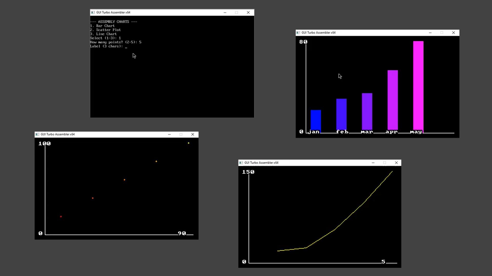

# Assembly Data Visualizer

A data visualization tool written in **x86 Assembly** that draws dynamic Bar Charts, Scatter Plots, and Line Charts.

## 🚀 Features

* **3 Chart Types:** Bar, Scatter, and Line (using Bresenham's algorithm).
* **Auto-Scaling:** Automatically fits your data to the screen size.
* **Interactive:** Menu-driven interface for custom data input.

## 🛠️ Prerequisites

To run this easily on modern Windows, use **GUI Turbo Assembler**.

* **Download:** [GUI Turbo Assembler (SourceForge)](https://sourceforge.net/projects/guitasm/)
* *Note: This tool bundles the assembler (TASM), linker (TLINK), and emulator (DOSBox) into one button press.*

## 💻 How to Run

1.  **Install:** Download and install **GUI Turbo Assembler**.
2.  **Open:** Launch the program.
3.  **Code:** Copy the contents of `PROJECT.ASM` and paste it into the editor.
4.  **Run:** Click the **Execute** button (or press `F9`).

## 📖 How to Use

Once the black console window appears:

1.  **Select Chart Type:**
    * Press `1` for Bar Chart.
    * Press `2` for Scatter Plot.
    * Press `3` for Line Chart.

2.  **Enter Data:**
    * Type how many points you want (e.g., `3`).
    * Enter your Labels (for bars) or X/Y Coordinates (for lines).
    * *Press ENTER after every number.*

3.  **View:** The chart will appear on the screen. Press any key to exit.

## 🧠 Technical Details

* **Language:** Assembly (TASM Syntax).
* **Processor:** Intel 8086 (16-bit).
* **Graphics:** VGA Mode 13h (Direct Video Memory Access).

## 📄 License

Open-source project for educational use.